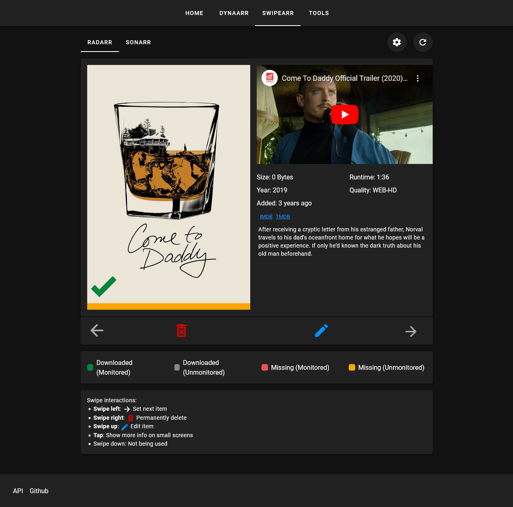
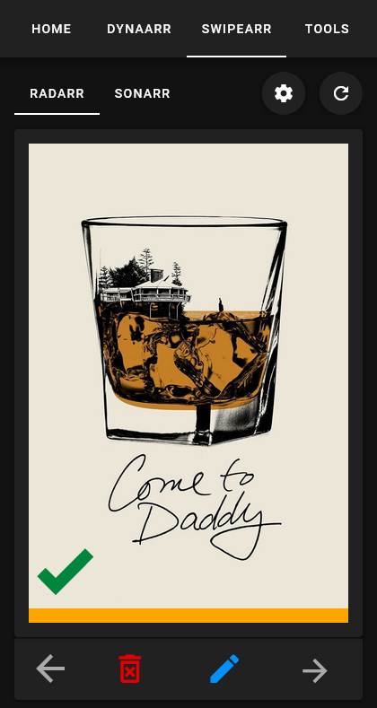
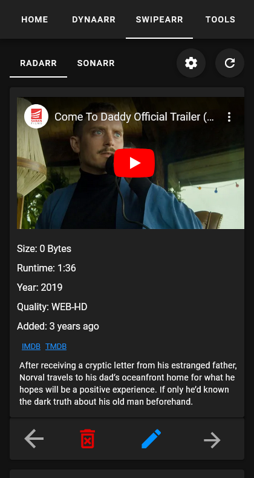
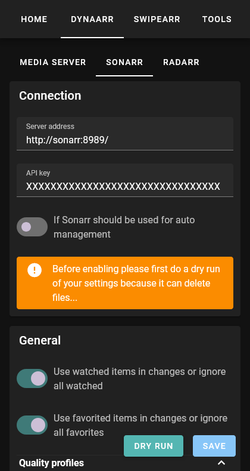

# More ARR tools
Welcome this repo contains tools that I use to manage my media library. Main tools are Dynarr and Swipearr. But there are more tools which are unlisted here.

## Dynarr
Dynarr helps manage the quality and organization of your files within Sonarr and Radarr, ensuring your media library is always optimized to your preferences.

### Features
- **Quality Profiles**: Automatically assign different quality profiles based on popularity and user preferences.
  - Ultra, High, Normal, Low, Favorited, On-Resume, Very Popular, Popular, Less Popular, Unpopular
- **Quality Upgrades**: Search and upgrade files to better quality versions.
- **Decay Management**: Automatically manage file retention based on specified decay days for various categories like favorites, suggested, popular, etc.
- **Monitoring**: Dynamically monitor or unmonitor files based on filters and user-defined criteria.
- **Exclusions**: Define tags and users to exclude from quality upgrades, monitoring, and deletions.
- **Popular Filters**: Customize filters for different popularity categories to better manage your collection.
- **Integration with Media Servers**: Create and manage collections in Emby/Jellyfin. Support for Plex can be added by editing `/utils/media_server_interaction.py`.

## Swipearr
Swipearr offers a Tinder-like interface for browsing your media collections, supporting desktop, mobile, and touchscreen devices.

### Features
- **Cross-Platform Compatibility**: Supports desktop and mobile devices.
- **Interaction Methods**: Use keyboard shortcuts, touchscreen, mouse, or swiping to browse your collections.
- **Web config**: Use a web interface to configure things.

## Screenshots






## Install
Unraid:
Use the community app store

Docker:
```sh
docker run --name arr-tools -p 9000:9000 -v $(pwd)/data:/app/backend/data ghcr.io/mah-thingies/arr-tools:latest
```

Docker compose:
```yml
version: '3.8'

services:
  arr-tools:
    image: ghcr.io/mah-thingies/arr-tools:latest
    container_name: arr-tools
    ports:
      - "9000:9000"
    volumes:
      - ./data:/app/backend/data
```

## Recommended things
### Tools
* [Recyclarr](https://github.com/recyclarr/recyclarr): creating Quality Profiles
* [Listrr](https://listrr.pro/): creating import lists

## Want to-do:
* Decaying watched episodes instead of instant delete
* Expanded tag exclusion like disable unmonitoring
* Expand filters and usage
* Web configurable running intervals
* Mass items selector(Arrs already have this but you need to hit a small radio button)
* Import/export playlists from external tools like spotify
* Convert music audio playlist to music video playlist
* Debug tags
* Support Readarr & Lidarr

## Possible issues:
* Large libraries might be slow, especially Sonarr(tested on 2000 series library)
* Deletion does not work if ARR can not delete items
* If you use multiple ARR instances like high and low quality instances, I did not have any problems

## Contribution
Plex support will not be added by me, someone can change `/utils/media_server_interaction.py` to support Plex.
